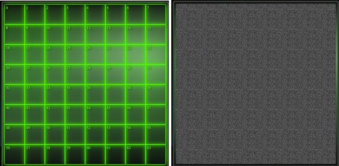

# Battleships #

Solo Project  
Time Frame: 8 days  
Play The Game:https://bit.ly/jrbattleships  


## Overview ##

This was my first project on the General Assembly Software Engineering course, where we were tasked to make a grid based game using HTML, CSS and JavaScript. I selected to do Battleships, as I was excited by the challenge of programming the computer to make moves tactically (and also I used to love this game when I was a kid).


## The Brief ##

* Create a grid based game in the browser.
* The game must be one player, where the user battles against the computer.
* The computer must be able to randomly place its pieces at the start of the game.
* The computer should be able to make random attacks on the players board.
* Design logic for winning and losing and display this on the screen.
* Include separate HTML, CSS and JavaScript files.
* Deploy your game online.


## Additional Challenges ##

* Include a responsive design.
* Have the computer make moves tactically.


## Technologies Used ##

* HTML5 (including HTML5 audio)
* CSS3 (including animation)
* JavaScript (ES6)
* Git
* GitHub

## Day 1 - Planning ##

When it came to the planning of this project, luckily the visuals and wireframe did not take too long, as I knew it would feature two grids that were side by side with an information box to display messages in. The main part of my planning was spent working on the pseudocode, trying to get my head around the functions I would need to create and the logic needed to make the game work. This was the pseudocode I presented at the project sign off:

```
//start game function to get the game rolling

// this will have the computer assign their ships randomly
// they will assign their biggest ship first (5 in length), as this is most difficult.
//the process for this will be:
// picks first grid spot randomly
//based on where they are on the grid (split into quarters)// that determines which direction it goes

// a similar formula can be used to place their 4 and 3 length ships

// the way of picking it's small ship (2 in length) is simple.
// pick a random square, then filter through the available grid spaces for other squares
//are plus 1, minus 1, plus 10 or minus 10

//at the end of it all, check to make sure there are no duplicates, if there are then the process
//starts again until there are no duplicates
// all computer ship places are stored in an array

// player then picks their ships, clicking on their grid to set them
// based on the value of the clicks, that assigns the ships
// run a check based on the maths of the arrays (so minus each one against each other) to ensure
// ships are placed properly, if not, the process starts again (with an alert to let the user know)
// all player ships are stored in an array

// then alternate turns to attack
// player click on enemy grid will check if the value of the target matches the value from the ships array
// if it does, it assigns that grid space with the class of hit
//also the message on the screen will change to mention that it was a hit
// otherwise it assigns that grid with a class of miss
// again, the message screen will change to highlight this being a miss

//on computer turn it chooses randomly from an array of Available Moves
//after each move, the unit chosen is spliced from the Available Moves array
//it will also store this move as a lastMove value

//if it's a hit, the area chosen will change to a class of hit (different style from the enemy grid hit)
//store that the computers last move was a hit in a variable (true)
// store their last move as well

// if it's a miss, changes that units class to miss (again, style differently to the enemy grid)

//if computers last move was a hit, it will first cycle through a new filter array called tacticalMoves
//(name might change)
//this filter will work out from available moves for what moves are next to the last stored move
//if the length of this array is 1 or more, then it choose a move from this array
//if not, then it does the standard selecting of a move

// same for the computer in terms of the screen changing messages depending on a hit or miss

//this pattern repeats itself until either the players ships.length or computers ships.length reaches
// 0 or less. This can be done by setting the other events inside a while loop with those conditions
// when the condition is met (someone runs out of ships), the game ends.
//for the game ending, both grids will fade to black through a class change, and the message on the screen
//will mention who was won.

// there will then be a reset button which will clear the grids of their classes
// as well as clear the ship arrays and kick off the start game function again

// I'll also add a counter below to keep track of how many enemy pieces and player pieces are left
// this can be linked via the DOM to the array lengths for each side


```

After getting the sign off, I was free to start work on the development.

## Days 2-5 - Creating MVP: ##

The first aspect I got to work on was to have the computer creating its ships. I needed it to create 5 ships in total of varying lengths and ensure that the ships stayed within the grid and didn’t overlap each other. To do this, I broke the process down into smaller chunks.

```
function computerShipBuilder(x){
    const newShip = []
    establishFirstPartOfShip(newShip)
    locateOnGrid(newShip)
    createRestOfShip(newShip, x)
    return newShip
}

function computerShip1(){
    computer.ship1 = computerShipBuilder(4)
}
```

First, I established the first grid space of the ship by having the computer select a number from random out of the available grid spaces. This original grid space then was used to dictate which direction the rest of the ship could be built in. For example, if the space selected was in the top left quarter of the grid, then the remaining pieces would be built either to the right or down. This ensured that the computer never went over the edge of the grid.

```
function establishFirstPartOfShip(arr){
    const shipPart1 = compGrid[Math.floor(Math.random() * compGrid.length)]
    arr.push(shipPart1)
}

function locateOnGrid(arr){
    if(arr[0] % 10 <= 4 && arr[0] < 50){
        increment1 = 1
        increment2 = 10
    } else if(arr[0] % 10 <= 4 && arr[0] > 50){
        increment1 = 1
        increment2 = -10
    } else if(arr[0] < 50){
        increment1 = -1
        increment2 = 10
    } else{
        increment1 = -1
        increment2 = -10
    }
}
```

Once this was established, I set up a function that randomly decided which of the increments to use, and then built the rest of the ship to the desired length.

```
function createRestOfShip(arr, x){
    const randomiser = Math.floor(Math.random()*2)
    const incrementChoice = randomiser === 1 ? increment1 : increment2
    for(let i = 0; i < x; i++){
        arr.push(arr[i] + incrementChoice)
    }
}
```

I created the longest ship for the computer first, as this meant future overlapping of ships would become less likely. For the other ships, after it was created I ran a check to see if any of the ship grid spaces overlapped. If they did, it simply recreated the last ship created. To do this I created an array made up of all the computer ships grid placements, then used this to make a new set to eliminate any duplicates. I compared the lengths, and if they were the same then I knew they were no overlapping ships.

```
function computerShip2(){
    computer.ship2 = computerShipBuilder(3)
    if(!compareShips()){
        computerShip2()
    }
}
```

```
function compareShips() {
    computerPieces = computer.ship1.concat(computer.ship2).concat(computer.ship3).concat(computer.ship4).concat(computer.ship5)
    testForDuplicates = new Set(computerPieces)
     return computerPieces.length === Array.from(testForDuplicates).length
}
```

After this was complete, the computer was successfully creating five different ships, all within the grid and none of which overlapped.

The player selection was done in a similar way. The player was prompted to type in their desired starting location for their ship, followed by a ‘v’ or a ‘h’ to determine if their ship would be placed vertically or horizontally. The code would then check to see if the ship would fit on the grid. If it did, the ship was built, the grids on the player’s grid became coloured in, and the process moved on to the next ship. If it didn’t, or if the ship overlapped an existing player ship, the process for that ship started again.

```
function collectPlayerData(){
        playerShip = document.getElementById("player-box").value
        playerShipStart = parseFloat(playerShip)
        playerDirection = playerShip.toLowerCase().split("")
    }
        
function playerShipBuilder(arr, x){
        let playerIncrement = 0
        if(playerDirection.includes("h")){
         playerIncrement = 1
        } else if(playerDirection.includes("v")){
         playerIncrement = 8
        } 
        arr.push(playerShipStart)
        let lastShipPart = playerShipStart
        for(let i = 0; i < x; i++){
        arr.push(lastShipPart + playerIncrement)
        lastShipPart += playerIncrement  
        }
    }

 function buildPlayerShip1(){
        collectPlayerData()
        if((playerDirection.includes("h") && playerShipStart % 8 < 4) || (playerDirection.includes("v") && playerShipStart < 32)){
            playerShipBuilder(player.ship1, 4)
            fillPlayerGrid(player.ship1)
            playerSetShip2()
        } else{
            window.alert("invalid entry. Please try again")
        }
    }
```

Once the ships were created, it was time to have them fire at one another. Again, these methods were somewhat similar, with the main difference being that the computer chose a random grid space from an array whereas the player choice was determined by where they clicked.

```
function playerFire(event){
        if(player.isTurn){
        const value = parseFloat(event.target.getAttribute("value"))
    if (computerPieces.includes(value)){
        event.target.classList.add("hit")
        const index = computerPieces.indexOf(value)
        computerPieces.splice(index, 1)
        compLives.textContent = computerPieces.length
    } else {
      event.target.classList.add("miss")
    }
    checkHealth()
    if(continueGameCheck()){
        setTimeout(computerTurn, 750)
    } else {
        endGame()
    } } }
```

Once the target had been established, the next thing to do was to work out if it was a hit or a miss, and change the styling on the grid space accordingly using DOM manipulation. After this, I created a function to check for the health of the player who had just been attacked. If a player’s health dropped to 5 or less, their grid style would change to start flashing red using a simple CSS animation I created. This also changed the messages the player would receive each turn (so if the computer was low on health the messages would urge the user to victory, whereas if the user was low on health, the messages would become more urgent).

After checking the health, the final thing to do was establish if the game needed to continue. This was done through a simple function that returned a boolean value depending on if either players’ health had reached 0. If it hadn’t, the game moved to the next player after a short timeout, and if it had then it triggered the endgame function.

```
function continueGameCheck(){
    return playerPieces.length > 0 && computerPieces.length > 0
}

function checkHealth(){
       if(computerPieces.length <= 0){
            messageScreen.textContent = "Congratulations, Captain! You have succesfully defeated the enemy fleet and saved us all!"
        } else if (computerPieces.length <= 5){
            enemyGrid.forEach(grid => grid.classList.add("danger"))
        }
        if(playerPieces.length <= 0){
            playerGrid.forEach(cell => cell.classList.remove("grid-on"))
            playerGrid.forEach(cell => cell.classList.remove("danger"))
            playerGrid.forEach(cell => cell.classList.add("player-loss"))
            messageScreen.textContent = "Captain!? ... Captain!? ... CCCCCAAAAPPPTTTTAAAAIIIINNNNN!!!!!"
        } else if (playerPieces.length <= 5){
            playerGrid.forEach(grid => grid.classList.add("danger"))
        }
    }
 ```
 
Once the endgame function was triggered, the grids and messages would change depending on who was victorious, and there were also different pieces of music that would play depending on if the user won or lost. This function also revealed a button that allowed the user to start another game without reloading the entire page.

## Days 6 & 7 - Extra Logic: ##

After setting up the functionality to have a basic game running, I then decided to go for one of my stretch goals to make the computer make its selections more tactically. Again, I decided to break this down into several steps. First, I added in two new variables that were booleans to track if the computer’s last two moves were hits or misses. If the last move was a hit, it would then filter from the available moves for spaces that were next to the last move location (this meant having to add in different options for the far left and far right of the grid, as otherwise the computer could select 1 position higher/lower for the next turn, which would be on a different row). If the second last move was a hit, but the last one was a miss, it would filter from the available moves for spaces next to the space that was a hit. Finally, if the last two moves were both hits, it would look at the direction the two moves were made in and then continue along that same path.

```
function computerSelectAfterHit(){
    let nextMoveChoices = []
    if(computer.lastPick % 8 === 0){
        nextMoveChoices = availableMoves.filter(i => i === computer.lastPick + 1 || i === computer.lastPick + 8 || i === computer.lastPick - 8)
    } else if((computer.lastPick + 1) % 8 === 0){
        nextMoveChoices = availableMoves.filter(i => i === computer.lastPick - 1 || i === computer.lastPick + 8 || i === computer.lastPick - 8)
    } else{
        nextMoveChoices = availableMoves.filter(i => i === computer.lastPick + 1 || i === computer.lastPick - 1 || i === computer.lastPick + 8 || i === computer.lastPick - 8)
    }
    nextMoveChoices.length > 0 ? compChoice = nextMoveChoices[Math.floor(Math.random() * nextMoveChoices.length)] : computerSelectAfterMiss()
    const index = availableMoves.indexOf(compChoice)
    availableMoves.splice(index, 1)
}
```

## Day 8 - Styling: ##

Once everything was running smoothly, I went to work on the styling. I decided to give my game the feel of being on an actual battleship, looking at a radar screen. I used an old terminal screen background image for the grids and then added a glow effect to the lines of the actual grid itself to give it the feel of an old radar computer. If the player lost the game, I had the entire player grid turn to static, as the narrative would be that the player has been destroyed.



I decided to have different styles for the player grid and computer grid to further differentiate the two and avoid any confusion. As a result, misses and hits on the computer grid are displayed by the grid space turning red or green. On the player grid they are resembled by crosses and static.

In the CSS I also added the extra class for when a player was in ‘danger’. This class was triggered when a player fell under 5 health, and as such would start a looping animation that caused the grid to start pulsing between red and green.

## Wins and Blockers: ##

Overall I consider the project a win, as at the end of the project I had a working game which my fellow classmates seemed to enjoy. I really got a hang of using DOM manipulation to toggle classes which allowed me to have different things appearing on the screen at different times (such as the red flashing animation, the reload game button, the text input for user ship creation, and even the numbers on the user grid). I also really got into the hang of making my functions more concise, but I know I could still do a better job.

For me the biggest blocker was the time it took me to get the computer ship placements working. It took me longer than I had originally thought it would. Getting the ships to not overlap was simple enough, but keeping them within the grid was frustrating. I finally came up with the idea to limit the directions the ships could be built in considering where the first selection was, and once I got this working the rest of the process really fell into place.

Ironically I would also call this process one of my biggest wins. For my first project, certain aspects of my code were not DRY, however the functions for building computer ships seemed really clean and simple. I think this was due to me taking the longest time working on it, but it certainly really demonstrated to me the advantages of keeping my code DRY and simple.

## Bugs: ##

* The user is able to click on a square they had already selected, and this will count as their go.
* If you play through several games in a row without reloading the page, occasionally the computer doesn’t take a turn.

## Key Learnings: ##

* DOM Manipulation.
* Use of Audio.
* Furthering my understanding of JavaScript fundamentals.
* The benefits of DRY, concise code.

## Future Content: ##

* Perfect the computer’s intelligence when picking moves.
* Show how many ships are still alive as opposed to the total tiles remaining.
* Add in different difficulty modes.


