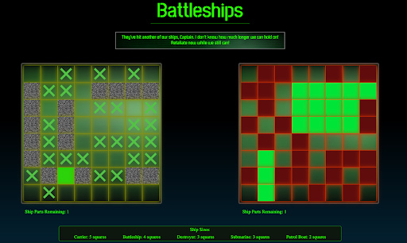

# Battleships #

Solo Project
Time Frame: 8 days
Play The Game:https://bit.ly/jrbattleships


## Overview ##

This was my first project on the General Assembly Software Engineering course, where we were tasked to make a grid based game using HTML, CSS and JavaScript. I selected to do Battleships, as I was excited by the challenge of programming the computer to make moves tactically (and also I used to love this game when I was a kid).




## The Brief ##

* Create a grid based game in the browser.
* The game must be one player, where the user battles against the computer.
* The computer must be able to randomly place its pieces at the start of the game.
* The computer should be able to make random attacks on the players board.
* Design logic for winning and losing and display this on the screen.
* Include separate HTML, CSS and JavaScript files.
* Deploy your game online.


## Additional Challenges ##

* Include a responsive design.
* Have the computer make moves tactically.


## Technologies Used ##

* HTML5 (including HTML5 audio)
* CSS3 (including animation)
* JavaScript (ES6)
* Git
* GitHub

## Day 1 - Planning ##

When it came to the planning of this project, luckily the visuals and wireframe did not take too long, as I knew it would feature two grids that were side by side with an information box to display messages in. The main part of my planning was spent working on the pseudocode, trying to get my head around the functions I would need to create and the logic needed to make the game work. This was the pseudocode I presented at the project sign off:

```
//start game function to get the game rolling

// this will have the computer assign their ships randomly
// they will assign their biggest ship first (5 in length), as this is most difficult.
//the process for this will be:
// picks first grid spot randomly
//based on where they are on the grid (split into quarters)// that determines which direction it goes

// a similar formula can be used to place their 4 and 3 length ships

// the way of picking it's small ship (2 in length) is simple.
// pick a random square, then filter through the available grid spaces for other squares
//are plus 1, minus 1, plus 10 or minus 10

//at the end of it all, check to make sure there are no duplicates, if there are then the process
//starts again until there are no duplicates
// all computer ship places are stored in an array

// player then picks their ships, clicking on their grid to set them
// based on the value of the clicks, that assigns the ships
// run a check based on the maths of the arrays (so minus each one against each other) to ensure
// ships are placed properly, if not, the process starts again (with an alert to let the user know)
// all player ships are stored in an array

// then alternate turns to attack
// player click on enemy grid will check if the value of the target matches the value from the ships array
// if it does, it assigns that grid space with the class of hit
//also the message on the screen will change to mention that it was a hit
// otherwise it assigns that grid with a class of miss
// again, the message screen will change to highlight this being a miss

//on computer turn it chooses randomly from an array of Available Moves
//after each move, the unit chosen is spliced from the Available Moves array
//it will also store this move as a lastMove value

//if it's a hit, the area chosen will change to a class of hit (different style from the enemy grid hit)
//store that the computers last move was a hit in a variable (true)
// store their last move as well

// if it's a miss, changes that units class to miss (again, style differently to the enemy grid)

//if computers last move was a hit, it will first cycle through a new filter array called tacticalMoves
//(name might change)
//this filter will work out from available moves for what moves are next to the last stored move
//if the length of this array is 1 or more, then it choose a move from this array
//if not, then it does the standard selecting of a move

// same for the computer in terms of the screen changing messages depending on a hit or miss

//this pattern repeats itself until either the players ships.length or computers ships.length reaches
// 0 or less. This can be done by setting the other events inside a while loop with those conditions
// when the condition is met (someone runs out of ships), the game ends.
//for the game ending, both grids will fade to black through a class change, and the message on the screen
//will mention who was won.

// there will then be a reset button which will clear the grids of their classes
// as well as clear the ship arrays and kick off the start game function again

// I'll also add a counter below to keep track of how many enemy pieces and player pieces are left
// this can be linked via the DOM to the array lengths for each side


```


